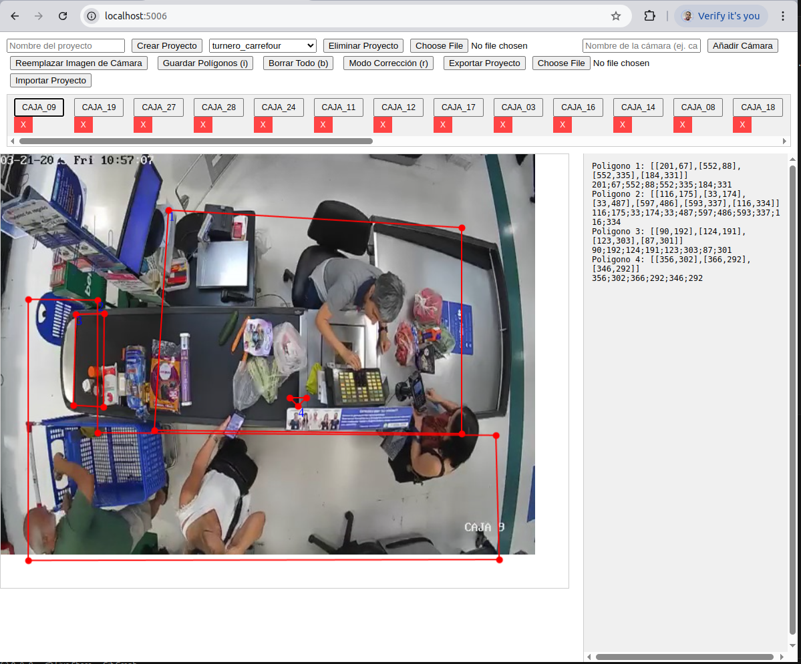

# Editor de Polígonos para aplicacioens de CV

Esta aplicación web permite crear, editar y gestionar polígonos sobre imágenes de cámaras en proyectos específicos. Es ideal para tareas como delimitar áreas en imágenes de vigilancia, exportar coordenadas en un formato legible y administrar múltiples cámaras y proyectos.



## Características
- Crear y gestionar proyectos con múltiples cámaras.
- Subir imágenes para cada cámara y dibujar polígonos sobre ellas.
- Editar polígonos en tiempo real (mover vértices, añadir puntos intermedios, eliminar vértices).
- Mostrar coordenadas en tiempo real ajustadas a las dimensiones originales de la imagen.
- Exportar proyectos como archivos `.zip` con imágenes, polígonos y coordenadas en un archivo `.txt`.
- Importar proyectos existentes desde archivos `.zip`.
- Eliminar cámaras y proyectos cuando ya no se necesiten.

## Requisitos
- **Docker**: Necesario para ejecutar la aplicación en un contenedor.
- **Docker Compose**: Para gestionar el contenedor y las dependencias.
- Un navegador web moderno (Chrome, Firefox, etc.).

## Instalación

1. **Clona el repositorio**:
   ```bash
   git clone https://github.com/amulet1989/polygons_editor.git
   cd polygons_editor

2. **Configura el archivo docker-compose.yml**:
Asegúrate de que el archivo docker-compose.yml esté en el directorio raíz con el siguiente contenido:

    ```bash
    version: '3'
    services:
        app:
            build: ./app
            ports:
                - "5006:5006"
            volumes:
                - ./app/projects:/app/projects
    ```
3. **Construye y ejecuta el contenedor**:
    ```bash
    docker-compose up --build -d

4. **Accede a la aplicación**:
Abre tu navegador y visita http://localhost:5006

## Estructura del Proyecto
```
├── app/
│   ├── Dockerfile          # Configuración de Docker para la aplicación
│   ├── app.py             # Código principal del servidor Flask
│   ├── static/
│   │   └── script.js      # Lógica del frontend (JavaScript con Fabric.js)
│   ├── templates/
│   │   └── index.html     # Interfaz de usuario
│   └── projects/          # Directorio donde se almacenan los proyectos (creado al ejecutar)
├── docker-compose.yml     # Configuración de Docker Compose
└── README.md              # Este archivo
```
## Uso

1. **Crear un Proyecto**
    
- En el campo "Nombre del proyecto", escribe un nombre (ejemplo: Turnero).

- Haz clic en "Crear Proyecto". El proyecto aparecerá en el selector de proyectos.

2. **Añadir una Cámara**

- Selecciona un proyecto del dropdown.

- En "Nombre de la cámara", escribe un nombre (ejemplo: caja01).

- Selecciona una imagen .jpg o .jpeg con el selector de archivos.

- Haz clic en "Añadir Cámara". La cámara aparecerá en la lista horizontal debajo de los controles.

3. **Dibujar Polígonos**

- Haz clic en el botón de una cámara (ejemplo: caja01) para cargarla en el canvas.

    **Crear un polígono**:

- Haz clic izquierdo en varios puntos para formar el polígono.

- Cierra el polígono haciendo clic cerca del primer punto (a menos de 10 píxeles).

- Usa clic derecho o Ctrl + Z para deshacer el último punto mientras dibujas.

- Los polígonos completados se numeran en azul y se muestran en el cuadro de texto a la derecha.

4. **Editar Polígonos**
- Presiona r o haz clic en "Modo Corrección (r)" para activar el modo de edición.

- Mover un vértice: Haz clic y arrastra un círculo rojo.

- Añadir un punto: Haz clic en un círculo rojo intermedio (aparece entre vértices).

- Eliminar un vértice: Selecciona un vértice y presiona Delete.

- Presiona r nuevamente para salir del modo corrección.

5. **Ver Coordenadas en Tiempo Real**
- A la derecha del canvas, un cuadro de texto muestra las coordenadas de los polígonos completados en la cámara actual.

Formato:

```
Poligono 1: [[217, 62], [195, 328], [554, 327], [550, 72]]
217;62;195;328;554;327;550;72
Poligono 2: [[597, 331], [596, 487], [27, 488], [31, 182]]
597;331;596;487;27;488;31;182
```

6. **Guardar Polígonos**
- Presiona i o haz clic en "Guardar Polígonos (i)" para guardar los polígonos de la cámara actual en un archivo .json.

7. **Reemplazar Imagen de Cámara**
- Selecciona una cámara cargada.

- Elige una nueva imagen y haz clic en "Reemplazar Imagen de Cámara". Los polígonos existentes se mantendrán.

8. **Eliminar Cámaras o Proyectos**
- Eliminar cámara: Haz clic en el botón "X" junto al nombre de la cámara y confirma.

- Eliminar proyecto: Selecciona un proyecto y haz clic en "Eliminar Proyecto", luego confirma.

9. **Exportar Proyecto**
- Selecciona un proyecto y haz clic en "Exportar Proyecto".

- Descargará un archivo .zip con:
    - Imágenes (.jpg) de las cámaras.

    - Archivos .json con los polígonos.

    - Un archivo <proyecto>_polygons.txt con las coordenadas en el formato mostrado en el cuadro de texto.

10. **Importar Proyecto**
- Selecciona un archivo .zip exportado previamente y haz clic en "Importar Proyecto".

- El proyecto se cargará y aparecerá en el selector.

11. **Borrar Polígonos**
Presiona b o haz clic en "Borrar Todo (b)" para eliminar todos los polígonos de la cámara actual (no se guarda hasta presionar i).

## Atajos de Teclado
- **Ctrl + Z**: Deshacer el último punto mientras dibujas.

- **i**: Guardar polígonos.

- **b**: Borrar todos los polígonos.

- **r**: Alternar modo corrección.

- **Delete**: Eliminar un vértice seleccionado en modo corrección.


## Ejemplo de Uso
1. Crea un proyecto llamado Turnero.

2. Añade una cámara caja01 con una imagen de 640x480.

3. Dibuja tres polígonos sobre la imagen.

4. En el cuadro de texto, verás algo como:

```
Poligono 1: [[217, 62], [195, 328], [554, 327], [550, 72]]
217;62;195;328;554;327;550;72
Poligono 2: [[597, 331], [596, 487], [27, 488], [31, 182]]
597;331;596;487;27;488;31;182
Poligono 3: [[96, 194], [133, 192], [135, 304], [96, 302]]
96;194;133;192;135;304;96;302
```

5. Guarda con i y exporta el proyecto. El archivo *Turnero_polygons.txt* tendrá el mismo contenido.

## Notas
- Dimensiones del canvas: El canvas se ajusta automáticamente a la imagen escalada más un margen de 50px a la derecha y abajo, permitiendo dibujar fuera de los límites de la imagen.

- Persistencia: Los proyectos se almacenan en ./app/projects/ y persisten entre reinicios gracias al volumen de Docker.

- Escalado: Las coordenadas mostradas y exportadas están en el espacio original de la imagen, no en el escalado del canvas.


